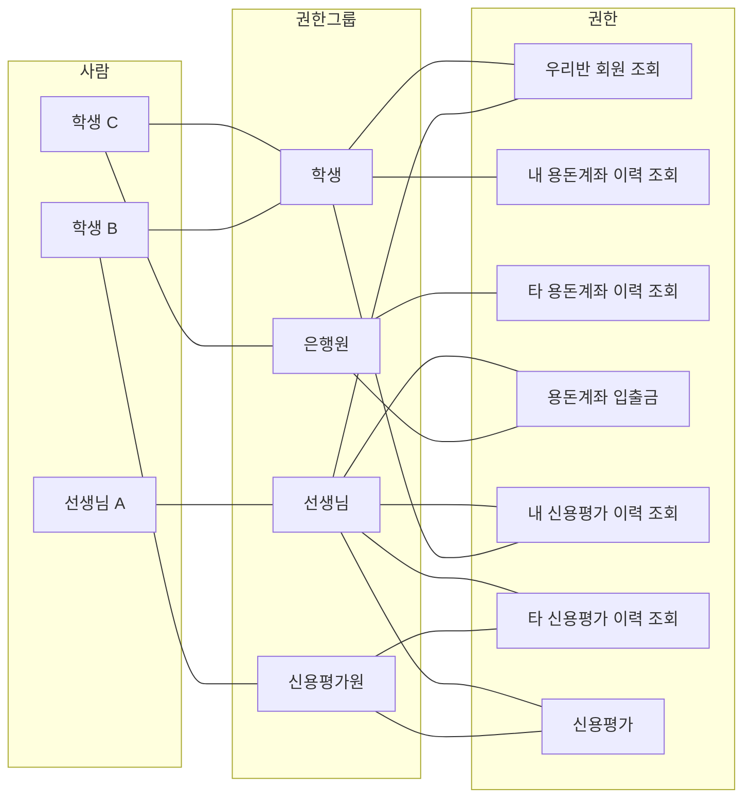

```mermaid
flowchart RL
    subgraph 권한
        r1[우리반 회원 조회]
        r2[내 용돈계좌 이력 조회]
        r3[타 용돈계좌 이력 조회]
        r4[용돈계좌 입출금]
        r5[내 신용평가 이력 조회]
        r6[타 신용평가 이력 조회]
        r7[신용평가]
    end

    subgraph 권한그룹
        teacher[선생님]
        student[학생]
        creditEvaluator[신용평가원]
        banker[은행원]
    end

    subgraph 사람
        A[선생님 A]
        B[학생 B]
        C[학생 C]
    end

    teacher --- A
    student --- B
    student --- C
    creditEvaluator --- B
    banker --- C
    r1 --- teacher
    r1 --- student
    r2 --- student
    r5 --- student
    r3 --- banker
    r4 --- banker
    r6 --- creditEvaluator
    r7 --- creditEvaluator
    r4 --- teacher
    r5 --- teacher
    r6 --- teacher
    r7 --- teacher
```
